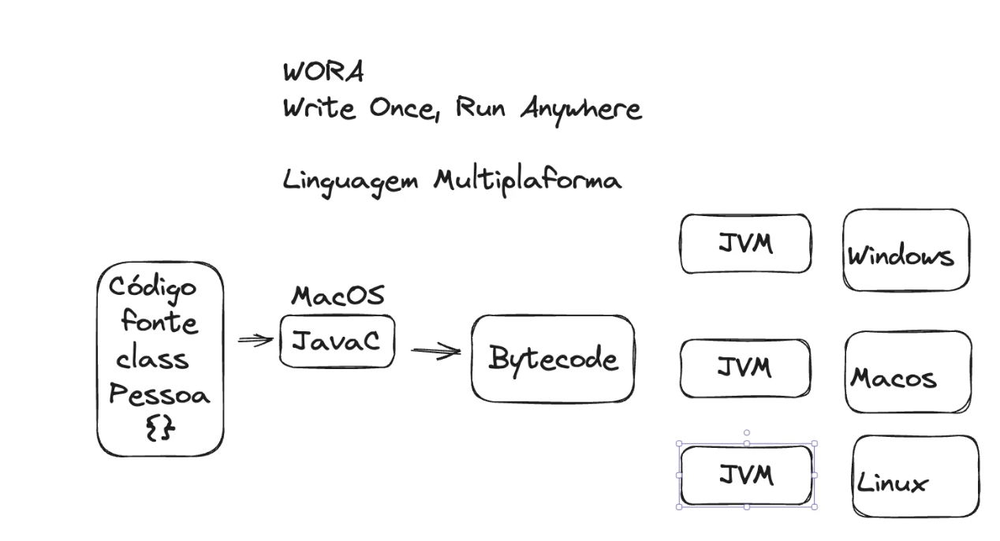

# Teoria Java

## introducao

- write one, run anywhere
  - multiplataforma
  - Codigo vonte -> javaC(no sistema op compila)->Bytecode -> jvm
  - 
  - Compilada(javac) e interpretada(JVM)

- Jre
  - Java Runtime Environment
  - JVM
  - So possui necessario para executar
  - Bibliotecas
  - Suporte e recursos

- Jdk
  - Java Development Kit
  - Jre
  - JavaTools->JavaC, debugger..

## Estruturas de dados simples

```java
import java.util.ArrayList;
import java.util.List;


public class EstruturaDeDados {
    public static void main(String[] args) {
        List<String> nomes = new ArrayList<>();

        nomes.add("marcus");
        nomes.add("Diego");
        
        System.out.println(nomes.get(0));
        System.out.println(nomes);

        for(String nome:nomes){
            System.out.println("O nome é:"+nome);
        }

        nomes.forEach(nome -> System.out.println(nome));
        nomes.forEach(System.out::println);


    }
}

```

### HashMap

>só pega um valor por chave, vai prevalecer a ultima. Chave valor 

```java
import java.util.HashMap;
import java.util.Map;

public class Colecoes {
    public static void main(String[] args) {   
        Map<String, Integer> notas = new HashMap<>();
        notas.put("marcus",10);
        notas.put("diego",8); 

        var nota = notas.get("marcus");
        System.out.println(nota);

        for(Map.Entry<String,Integer> entry: notas.entrySet()){
            String key = entry.getKey();
            Integer value = entry.getValue();
            System.out.println("A chave é "+key+"como o valor de "+value);
        }
    }
}
```


### HashSet

>Nocao somente de valor, nao contem index. Ideia de conjuntos

```java
import java.util.HashSet;
import java.util.Set;

public class ColecaoHashSet {
    public static void main(String[] args) {
        Set<Integer> numeros = new HashSet<>();
        numeros.add(10);
        numeros.add(11);
        numeros.add(12);
        numeros.add(13);

        numeros.remove(12);

        for(Integer elemento: numeros){
            System.out.println(elemento);
        }

        System.out.println(numeros.contains(14));

    }
}
```
